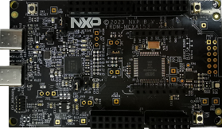
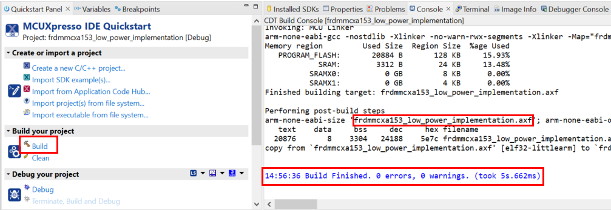
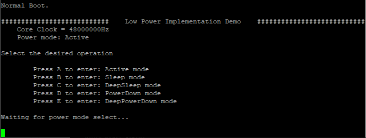
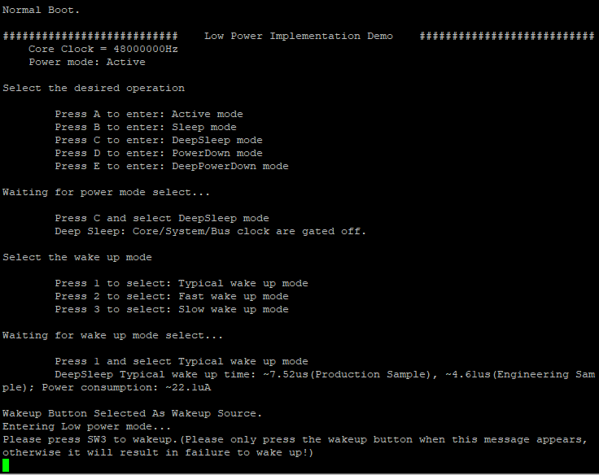
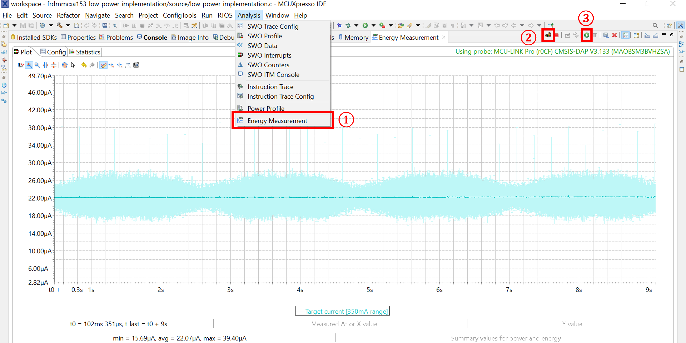

# NXP Application Code Hub

## How to implement low power on MCXA153
The low power implementation demo is used for power mode switch, wake up time measurement and low power current measurement on the FRDM-MCXA153 board.

#### Boards: FRDM-MCXA153
#### Categories: Low Power, Power Conversion
#### Peripherals: CLOCKS, UART
#### Toolchains: MCUXpresso IDE

## Table of Contents
1. [Software](#step1)
2. [Hardware](#step2)
3. [Setup](#step3)
4. [Results](#step4)
5. [FAQs](#step5) 
6. [Support](#step6)
7. [Release Notes](#step7)

## 1. Software
- [MCUXpresso IDE V11.9.0 or later](https://www.nxp.com/design/software/development-software/mcuxpresso-software-and-tools-/mcuxpresso-integrated-development-environment-ide:MCUXpresso-IDE)
- [SDK_2.14.0_FRDM-MCXA153](https://mcuxpresso.nxp.com/en/welcome)
- MCUXpresso for Visual Studio Code: This example supports MCUXpresso for Visual Studio Code, for more information about how to use Visual Studio Code please refer [here](https://www.nxp.com/design/training/getting-started-with-mcuxpresso-for-visual-studio-code:TIP-GETTING-STARTED-WITH-MCUXPRESSO-FOR-VS-CODE).

## 2. Hardware
- FRDM-MCXA153 Rev A board:

- One Type-C USB cable.

> If you want to measure wake up time, prepare an oscilloscope.

> If you want to measure low power current, prepare [MCU-Link Pro](https://www.nxp.com/design/design-center/software/development-software/mcuxpresso-software-and-tools-/mcu-link-pro-debug-probe:MCU-LINK-PRO) or Ammeter.

## 3. Setup

### 3.1 Hardware connection
- Use a Type-C USB cable to connect J15 of FRDM-MCXA153 and the USB port of the PC.

### 3.2 Import Project
1. Open MCUXpresso IDE 11.9.0, in the Quick Start Panel, choose **Import from Application Code Hub**

2. Enter the **demo name** in the search bar.

3. Click **Copy GitHub link**, MCUXpresso IDE will automatically retrieve project attributes, then click **Next>**.

4. Select **main** branch and then click **Next>**, select the MCUXpresso project, click **Finish** button to complete import.

> You need to install the [SDK_2.14.0_FRDM-MCXA153](https://mcuxpresso.nxp.com/en/welcome) on your MCUXpresso IDE.

### 3.3 Build and Flash Project
- Click **Build** button from the toolbar, then wait for the build to complete.

- Select the **GUI Flash Tool** from the toolbar to program the executable to the board.

### 3.4 Select low power mode and wake up configurations
- Open a serial terminal.
- Follow the prompts and enter one from A to E to enter different low power mode.

- Follow the prompts and enter one from 1 to 3 to select the wake up mode.

- Prompts the selected low power mode and wake up mode, the corresponding reference wake up time and low power current, and press SW3 on FRDM-MCXA153 to wake up the MCU. 
 
  **Please only press the wakeup button when prompt message appears, otherwise it will result in failure to wake up!**

 

### 3.5 Measure low power current
- Use MCU-Link Pro and MCUXpresso IDE to measure low power current:
  - Connect MCU-Link Pro board to FRDM-MCXA153 board.
  
  |MCU-Link Pro|FRDM-MCXA153|
  |--|--|
  |J9-1|JP2-1|
  |J9-3|JP2-2|
  |J9-2|J3-14|

  - Follow below steps to measure current with MCUXpresso IDE.

- You can also use an ammeter to measure the current at JP2 of the FRDM-MCXA153 board.

### 3.6 Measure wake up time
- Get the wake up time by measuring the delay between the falling edges of J1-1 (P1_7) and J4-12 (P3_30) using an oscilloscope.

## 4. Results
The following wake up time and low power current are provided as a reference:

>The typical wake up time correspond to low power wake up time in the datasheet.

>Temperature, measuring instrument and wake up source etc. can affect wake up time.

>There is no special gate all peripherals clock, and DeepPowerDown mode retained all RAM, so the measured current will be a little different from the data in the datasheet.

|power mode|wake up mode|wake up time|low power current|
|--|--|--|--|
|Sleep|Typical|0.27us|1.72mA|
|Sleep|Fast|0.14us|3.31mA|
|Sleep|Slow|1.02us|0.83mA|
|DeepSleep|Typical|4.62us|23.2uA|
|DeepSleep|Fast|2.66us|993.1uA|
|DeepSleep|Slow|11.94us|23.2uA|
|PowerDown|Typical|10.07us|6.8uA|
|PowerDown|Fast|4.49us|218.2uA|
|PowerDown|Slow|36.94us|6.8uA|
|DeepPowerDown|Typical|2.97ms|1.12uA|

## 5. FAQs
*No FAQs have been identified for this project.*

## 6. Support
*Please contact NXP for additional support.*

#### Project Metadata
<!----- Boards ----->

<!----- Categories ----->
 

<!----- Peripherals ----->
 

<!----- Toolchains ----->

Questions regarding the content/correctness of this example can be entered as Issues within this GitHub repository.

>**Warning**: For more general technical questions regarding NXP Microcontrollers and the difference in expected funcionality, enter your questions on the [NXP Community Forum](https://community.nxp.com/)

## 7. Release Notes
| Version | Description / Update                           | Date                        |
|:-------:|------------------------------------------------|----------------------------:|
| 1.0     | Initial release on Application Code Hub        | January 30th 2024 |

